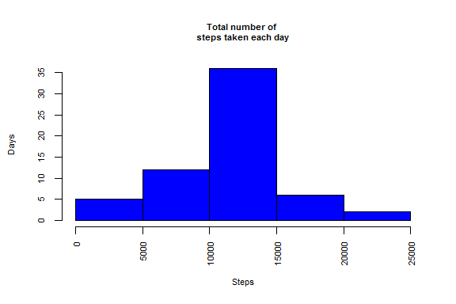

# Reproducible Research: Peer Assessment 1


```r
  options(warn = -1)
  library(plyr)
  library(lattice)
  library(utils)
```

### Loading and preprocessing the data
* Load the data (i.e. read.csv())  
* Process/transform the data (if necessary) into a format suitable for your analysis  


```r
  # Set working directory
  setwd ("C:/Temp")
  # Download data.zip from the web
  download.file("http://d396qusza40orc.cloudfront.net/repdata%2Fdata%2Factivity.zip",destfile = "activity.zip",mode = "wb",cacheOK = FALSE)
  # Unzip file
  unzip("activity.zip")
  
  activity <- read.csv("C:/Temp/activity.csv"
                       ,header = TRUE
                       ,stringsAsFactors = FALSE)
  
  dfactivity <- data.frame(steps = as.numeric(activity$steps)
                           ,date = as.Date(activity$date)
                           ,interval = as.numeric(activity$interval))
```


### What is mean total number of steps taken per day?
* For this part of the assignment, you can ignore the missing values in the dataset.
* Make a histogram of the total number of steps taken each day
* Calculate and report the mean and median total number of steps taken per day


```r
  spdTotal <- aggregate(steps ~ date,dfactivity,sum)
  
  hist(spdTotal$steps
       ,main = "Histogram of the total number of \nsteps taken each day"
       ,xlab = "Steps"
       ,ylab = "Days"
       ,border = "black" 
       ,col = "blue"
       ,las = 3 #x label angle
       ,cex.lab = 0.7
       ,cex.axis = 0.7
       ,cex.main = 0.7)
```

 

```r
  dfactivityna <- na.omit(dfactivity)
  
  stepsMean <- mean(dfactivityna$steps[dfactivityna$steps > 0]) # Ignore Zeros
  cat("What is mean total number of steps taken per day?:",as.character(round(stepsMean,4)))
```

```
## What is mean total number of steps taken per day?: 134.2607
```

```r
  stepsMedian <- median(dfactivityna$steps[dfactivityna$steps > 0]) # Ignore Zeros
  cat("What is median total number of steps taken per day?:",as.character(stepsMedian))
```

```
## What is median total number of steps taken per day?: 56
```

### What is the average daily activity pattern?
* Make a time series plot (i.e. type = "l") of the 5-minute interval (x-axis) 
    and the average number of steps taken, averaged across all days (y-axis)

* Which 5-minute interval, on average across all the days in the dataset, 
    contains the maximum number of steps?


```r
dailyActivity <- na.omit(data.frame(steps = dfactivity$steps
                                      ,interval = dfactivity$interval
                                      ,day = dfactivity$date))
  
  avgDailyActivity <- aggregate(dailyActivity$steps
                                ,by = list(dailyActivity$interval)
                                ,FUN = mean
                                ,na.rm = TRUE)
  
  plot(avgDailyActivity
       ,type = "l"
       ,main = "Average Number of \nSteps Taken by Interval"
       ,ylab = "Steps"
       ,xlab = "Interval"
       ,cex.lab = 0.7
       ,cex.axis = 0.7
       ,cex.main = 0.7)
```

 

```r
  maxSteps <- max(avgDailyActivity$x)
  cat("The 5-minute interval, on average across all the days in the dataset, that contains the maximum number of steps:",as.character(round(maxSteps,2)))
```

```
## The 5-minute interval, on average across all the days in the dataset, that contains the maximum number of steps: 206.17
```
  
### Imputing missing values
* Note that there are a number of days/intervals where there are missing values 
    (coded as NA). The presence of missing days may introduce bias into some 
    calculations or summaries of the data.

* Calculate and report the total number of missing values in the dataset 
    (i.e. the total number of rows with NAs)

* Devise a strategy for filling in all of the missing values in the dataset. 
    The strategy does not need to be sophisticated. 
    For example, you could use the mean/median for that day, or the mean for 
    that 5-minute interval, etc.

* Create a new dataset that is equal to the original dataset but with the 
    missing data filled in.

* Make a histogram of the total number of steps taken each day 
    and Calculate and report the mean and median total number of 
    steps taken per day. Do these values differ from the estimates from the 
    first part of the assignment? 

* What is the impact of imputing missing data on the estimates of the 
    total daily number of steps?


```r
avgIntervalSteps <- aggregate(activity$steps ~ activity$interval,FUN = mean,na.rm = TRUE)
  #NA rows only
  naIntervalSteps <-  activity[is.na(activity$steps),]
  # NON NA rows only
  notnaIntervalSteps <-  activity[!is.na(activity$steps),]
  
  missingValues <- nrow(naIntervalSteps)
  
  cat("Total number of missing values in the dataset: ",as.character(missingValues))
```

```
## Total number of missing values in the dataset:  2304
```

```r
  # Update the NA rows with the average mean for the corresponding Interval  
  naIntervalSteps$steps <- avgIntervalSteps[match(naIntervalSteps$interval, avgIntervalSteps$`activity$interval`),2]
  
  # Bind the NON NA and NA rows to create a complete dataset and round the steps values
  dfData <- rbind(notnaIntervalSteps,naIntervalSteps)
  dfData$steps <- round(dfData$steps)
  
  dfhist <- aggregate(dfData$steps
                      ,by = list(dfData$interval)
                      ,FUN = sum
                      ,na.rm = TRUE)
  
  hist(dfhist$x
       ,main = "Total number of \nsteps taken each day"
       ,xlab = "Steps"
       ,ylab = "Days"
       ,border = "black" 
       ,col = "blue"
       ,las = 3 #x label angle
       ,cex.lab = 0.7
       ,cex.axis = 0.7
       ,cex.main = 0.7)
```

 

```r
  spdAllMean <- mean(dfhist$x)
  cat("Imputed - Mean total number of steps taken per day:",as.character(round(spdAllMean,4)))
```

```
## Imputed - Mean total number of steps taken per day: 2280.2222
```

```r
  spdAllMedian <- median(dfhist$x)
  cat("Imputed - Median total number of steps taken per day:",as.character(spdAllMedian))
```

```
## Imputed - Median total number of steps taken per day: 2084
```
  
### Are there differences in activity patterns between weekdays and weekends?
* For this part the weekdays() function may be of some help here. 
* Use the dataset with the filled-in missing values for this part.

* Create a new factor variable in the dataset with two levels 
    -- "weekday" and "weekend" indicating whether a given date is a 
    weekday or weekend day.

* Make a panel plot containing a time series plot (i.e. type = "l") 
    of the 5-minute interval (x-axis) and the average number of steps taken, 
    averaged across all weekday days or weekend days (y-axis). The plot should 
    look something like the following, which was created using simulated data:


```r
dfWeekdays <- subset(dfData,weekdays(as.Date(dfData$date)) %in% c("Monday", "Tuesday", "Wednesday", "Thursday","Friday"))
  dfWeekends <- subset(dfData,weekdays(as.Date(dfData$date)) %in% c("Saturday", "Sunday"))
  
  avgWeekdays <- mean(dfWeekdays$steps)
  avgWeekends <- mean(dfWeekends$steps)
  
  cat("Average Weekdays:",as.character(round(avgWeekdays,4)))
```

```
## Average Weekdays: 35.6086
```

```r
  cat("Average Weekends:",as.character(round(avgWeekends,4)))
```

```
## Average Weekends: 42.3646
```

```r
  dfData$dayType <- factor(weekdays(as.Date(dfData$date)) %in% c("Monday", "Tuesday", "Wednesday", "Thursday","Friday")
         ,levels = c(FALSE, TRUE)
         ,labels = c('weekend', 'weekday'))
  
  sumSteps <- ddply(dfData,.(interval,dayType), summarize, steps = sum(steps))
  
  xyplot(sumSteps$steps ~ sumSteps$interval | sumSteps$dayType
         ,data = sumSteps
         ,main = "Average Steps by 5 minute Interval \nfor Weekends and Weekdays"
         ,xlab = "Interval"
         ,ylab = "Number of Steps"
         ,type = "l"
         ,layout = c(1,2))
```

 
